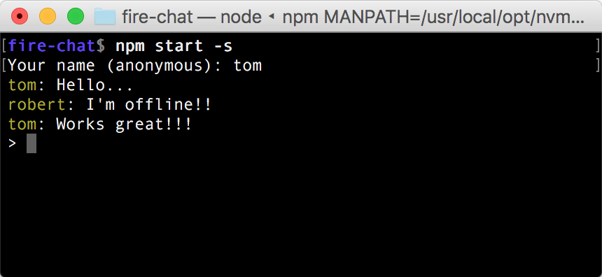

This is a very simple terminal chat app. Every users are chatting on the same channel.   
The purpose was to play with [Firebase](https://firebase.google.com/) which made it amazingly simple! I'm also using typescript and `async`/`await`.

### Features
- No login needed
- You see messages from any other user
- You can use multiple terminals and talk to yourself...
- Works offline. Messages are synced once you get back online.

### Setup

- Clone this repo
- Make sure you're using node 6+
- `npm install`
- `npm start -s`
- Start chatting with anybody else using the app!